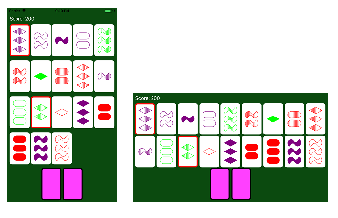

# Set (Card Game)

This is a iOS version of the __Set__ card game. This app demonstrates the use of several elements of iOS development including AutoLayout, Core Graphics, Core Animation, MVC design, Gesture Recognition, laying out views in code, and much more!

## Features

The features of this application include:

* Views adjust for portrait / landscape device orientation
* Animation of cards being dealt
* Card dimensions shrink as more cards are dealt (all cards can be displayed at once)
* Upon successful match, matched cards will animate around screen before return to discard pile
* Tap to select cards. Selected cards
* Swipe down or tap on deck (left at bottom) to deal 3 more cards
* Rotate gesture (2 fingers) to shuffle layout of current cards

## Getting Started

After cloning this repository, build and run the application on the desired device or simulator. You will immediately begin a new game once application launches. Continue forming sets until you have gone through all 81 cards!

## Resources

* [How to Play](https://www.setgame.com/set/puzzle_rules)
* [Set Official Page](https://www.setgame.com/)
* [Wikipedia Page on Set](https://en.wikipedia.org/wiki/Set_(card_game))
